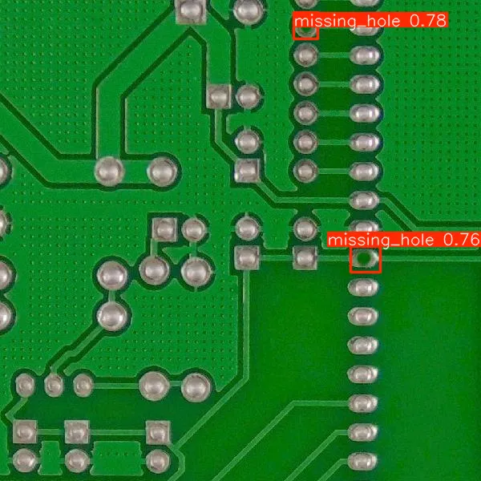
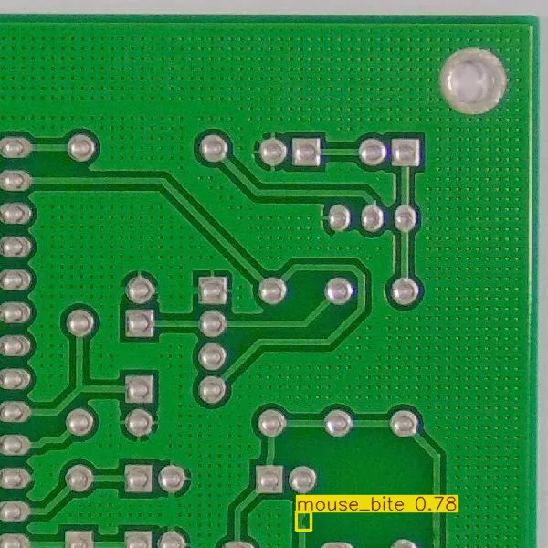
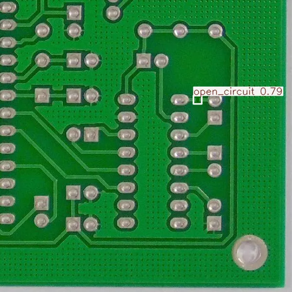
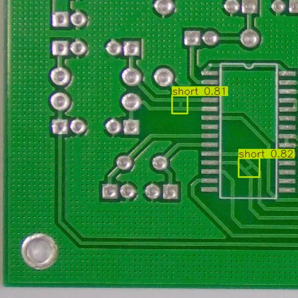
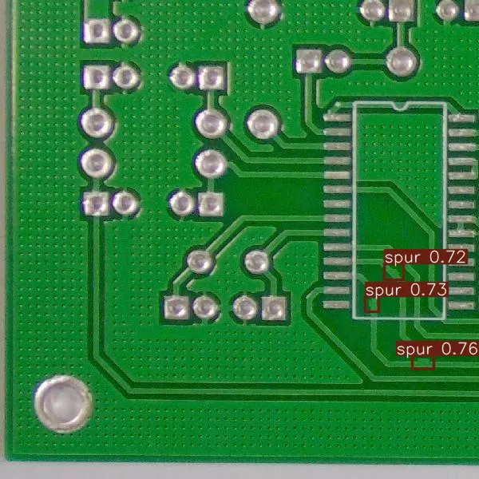
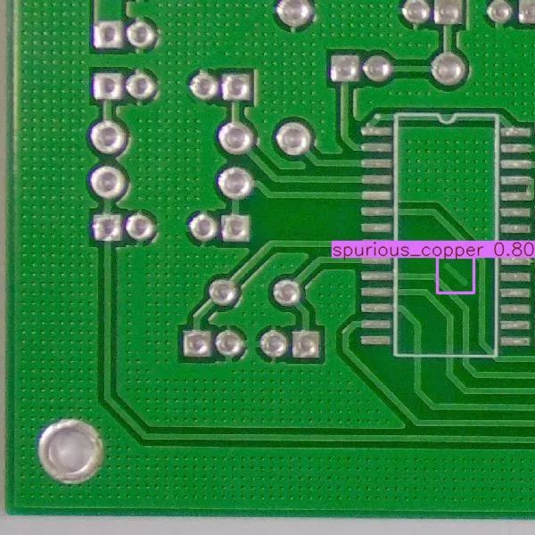
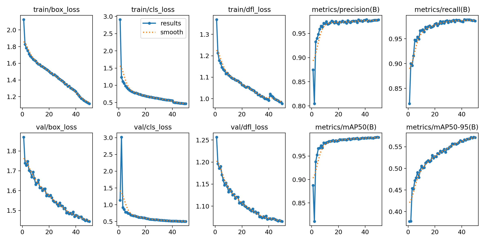
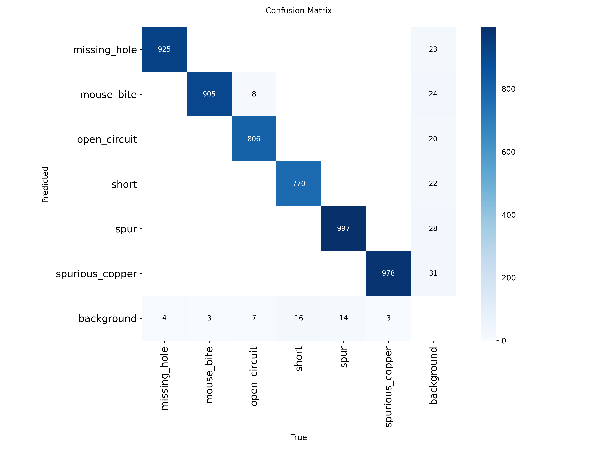
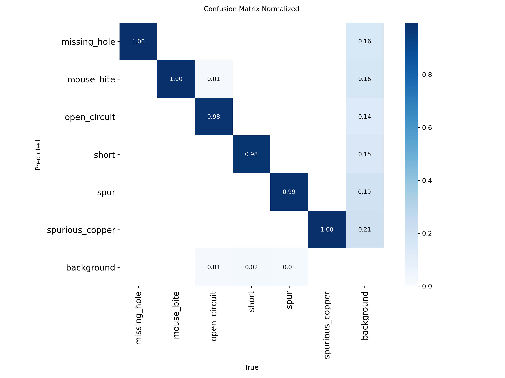
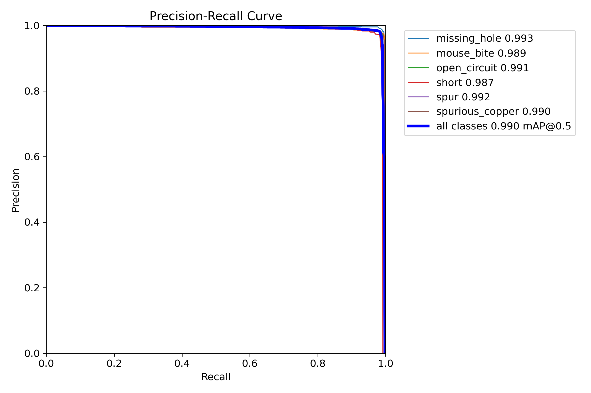

# PCB Defect Detector

> 该项目为展示项目。

> 基于 YOLOv8s 的 PCB 板面缺陷检测系统——支持 6 类常见缺陷检测，mAP50 **0.990**，端到端推理速度 **15.3ms**（约 65 FPS）。

[](https://github.com/ultralytics/ultralytics)
[](https://python.org)
[](https://developer.nvidia.com/cuda-toolkit)

---

## 效果展示

|                     missing_hole（漏孔）                      |                   mouse_bite（鼠咬缺口）                    |                       open_circuit（开路）                       |
| :-----------------------------------------------------------: | :---------------------------------------------------------: | :--------------------------------------------------------------: |
|  |  |     |
|                       **short（短路）**                       |                      **spur（毛刺）**                       |                 **spurious_copper（多余铜箔）**                  |
|         |        |  |

> 每张图为 YOLOv8 自动标注后的检测结果。框的颜色对应不同缺陷类别，上方标注类别名与置信度。

---

## 🏆 核心成果

### 检测精度

|    缺陷类别     | 精确率 (P) | 召回率 (R) |   mAP50   | mAP50-95  |
| :-------------: | :--------: | :--------: | :-------: | :-------: |
|     **all**     | **0.977**  | **0.987**  | **0.990** | **0.573** |
|  missing_hole   |   0.979    |   0.996    |   0.993   |   0.624   |
|   mouse_bite    |   0.972    |   0.996    |   0.989   |   0.570   |
|  open_circuit   |   0.984    |   0.981    |   0.991   |   0.532   |
|      short      |   0.973    |   0.973    |   0.987   |   0.583   |
|      spur       |   0.981    |   0.981    |   0.991   |   0.568   |
| spurious_copper |   0.974    |   0.993    |   0.990   |   0.562   |

> 验证集 2,616 张，共 5,436 个标注实例。硬件：NVIDIA RTX 4060 Laptop GPU (8GB)。

### 推理速度

| 指标        |                     数值                      |
| :---------- | :-------------------------------------------: |
| 模型        |          YOLOv8s（11.1M 参数，22MB）          |
| 输入尺寸    |                    640×640                    |
| 端到端延迟  | **15.3ms**（含 I/O + 预处理 + 推理 + 后处理） |
| 纯 GPU 推理 |                     6.7ms                     |
| 实际 FPS    |                    **~65**                    |

### 加速对比

|     推理引擎     |        延迟         |    FPS     |  相对加速比  |
| :--------------: | :-----------------: | :--------: | :----------: |
|   PyTorch FP32   |     **15.3ms**      |   **65**   | 1.0×（基线） |
| ONNX Runtime GPU |       14.0ms        |     71     |     1.1×     |
|  TensorRT FP16   | _待 Linux 环境测试_ | _预期 3×+_ |      —       |

> ONNX 在小模型上收益有限（推理时间远小于数据拷贝时间）。TensorRT 在 Linux 环境预期加速 3×+。

### 训练配置

| 参数     |        值         |
| :------- | :---------------: |
| 训练集   |     10,710 张     |
| 验证集   |     2,616 张      |
| 训练轮数 |     50 epoch      |
| 优化器   | AdamW（自动选择） |
| 学习率   |       0.01        |
| 批大小   |         8         |
| 显存占用 |      ~2.1GB       |
| 训练时长 |        ~5h        |

## ⚡ 快速开始

```bash
# 1. 克隆仓库
git clone https://github.com/你的用户名/pcb-defect-detector.git
cd pcb-defect-detector

# 2. 创建环境并安装依赖
# 如果安装cuda版本，需要先执行命令：

pip install torch torchvision torchaudio --index-url https://download.pytorch.org/whl/cu124

# 之后再执行以下命令可以确保安装cuda版本的torch

pip install -r requirements.txt

# 3. 启动 Gradio Demo
python app.py
# 浏览器打开 http://localhost:7860
```

---

## 🚀 部署流水线

### 模型导出

```bash
# PyTorch → ONNX
yolo export model=weights/best.pt format=onnx imgsz=640

# PyTorch → TensorRT FP16（加速 3×+）
yolo export model=weights/best.pt format=engine imgsz=640 half=True

# PyTorch → TensorRT INT8（加速 5×+）
yolo export model=weights/best.pt format=engine imgsz=640 int8=True
```

### 部署框架选型

| 平台                | 推荐框架     | 导出命令                  |
| :------------------ | :----------- | :------------------------ |
| NVIDIA GPU / Jetson | TensorRT     | `format=engine half=True` |
| 跨平台 CPU / GPU    | ONNX Runtime | `format=onnx`             |
| Intel 边缘设备      | OpenVINO     | `format=openvino`         |
| 移动端 ARM          | NCNN         | `format=ncnn`             |

---

## 🧠 技术要点

### 小目标检测优化

PCB 缺陷（尤其是 mouse_bite、spur）在 640×640 输入下仅 10-30 像素，属于典型的小目标检测。优化策略：

- **多尺度预测**：YOLOv8 原生 P3/P4/P5 三尺度
- **数据增强**：Mosaic + MixUp 组合
- **预训练迁移**：COCO 预训练权重启动，收敛快 3×
- **早停**：patience=15，防止过拟合

### 边缘案例处理

- 6 类缺陷样本分布均匀（每类 800-1000 实例），未使用 class weights
- 验证集 31 张背景图片全部正确识别为负样本（0 误报）
- YOLOv8 Anchor-Free 设计天然减少重叠框

### 工业部署考虑

- 模型体积约 **22MB**（FP32），INT8 量化后约 **6MB**
- 端到端延迟 **15.3ms**，满足产线 30fps 要求
- 支持 TensorRT / OpenVINO / ONNX Runtime 多种部署后端

---

## 📊 训练报告

### mAP 与 Loss 曲线



> mAP50 在约 20 epoch 后趋于稳定，val/box_loss 无反弹（无过拟合）。

### 混淆矩阵

|                            原始                             |                                 归一化                                 |
| :---------------------------------------------------------: | :--------------------------------------------------------------------: |
|  |  |

> 对角线均接近 1.0，6 类之间无明显误判。spur 与 spurious_copper 有轻微混淆（形态相似）。

### PR 曲线



> 各类 AP 均接近 0.99，曲线在 Recall 0.9 之前保持 Precision > 0.95。

---

## 📁 项目结构

```
pcb-defect-detector/
├── README.md                 ← 本文档
├── requirements.txt          ← 依赖
├── app.py                    ← Gradio 主入口
├── weights/
│   ├── best.pt               ← YOLOv8s 权重
│   └── best.onnx             ← ONNX 导出
├── data/
│   ├── PCB Defects.v6i.yolov8/  ← 数据集（from https://universe.roboflow.com/university-2xdiy/pcb-defects-chi1b）
│   ├── sample_images/        ← 示例原图
│   └── sample_results/       ← 效果图
├── reports/
│   ├── train/                ← 训练结果
│   │   ├── results.png              ← 训练曲线（loss + mAP）
│   │   ├── confusion_matrix.png     ← 混淆矩阵
│   │   ├── confusion_matrix_normalized.png
│   │   ├── BoxPR_curve.png          ← PR 曲线（各类别）
│   │   ├── train_batch*.jpg         ← 训练批次样例
│   │   └── val_batch*_pred.jpg      ← 验证集推理效果样例
│   └── val/                  ← 验证结果，内文件参照 train/
├── notebooks/
│   ├── benchmark.py          ← 速度对比脚本
│   └── train.py              ← 训练脚本
└── docs/
    ├── benchmark_report.md
    └── training_log.md
```

---

## 🖥️ 在线 Demo

```bash
python app.py
# 浏览器打开 http://localhost:7860
```

---

## 🛠️ 技术栈

| 类别   | 技术                             |
| :----- | :------------------------------- |
| 框架   | Ultralytics YOLOv8s, PyTorch 2.6 |
| 部署   | ONNX, TensorRT, OpenVINO         |
| 前端   | Gradio                           |
| 可视化 | Matplotlib, TensorBoard          |
| 硬件   | NVIDIA RTX 4060 Laptop GPU (8GB) |

---

## 📚 参考资料

- [Ultralytics YOLOv8 官方文档](https://docs.ultralytics.com)
- [DeepPCB 缺陷数据集](https://universe.roboflow.com/university-2xdiy/pcb-defects-chi1b)
- [TensorRT 部署优化指南](https://docs.ultralytics.com/guides/model-deployment-options)
- [LearnOpenCV: YOLOv8 训练指南](https://learnopencv.com/ultralytics-yolov8)

---

## 📄 License

MIT
